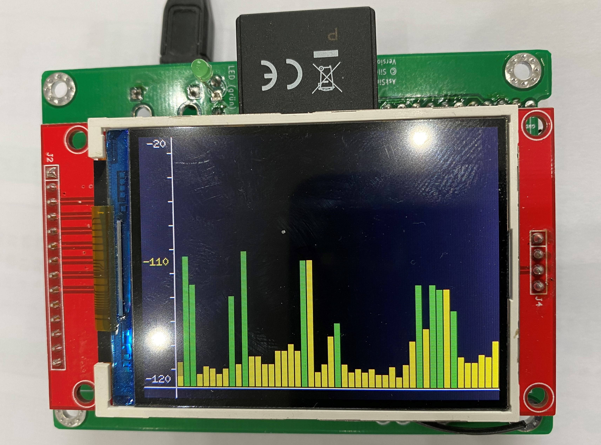
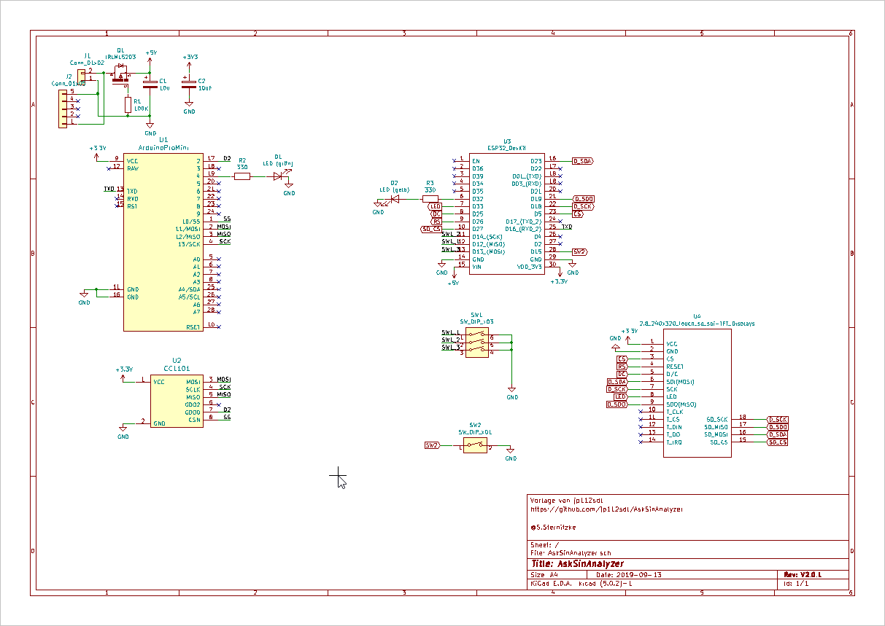
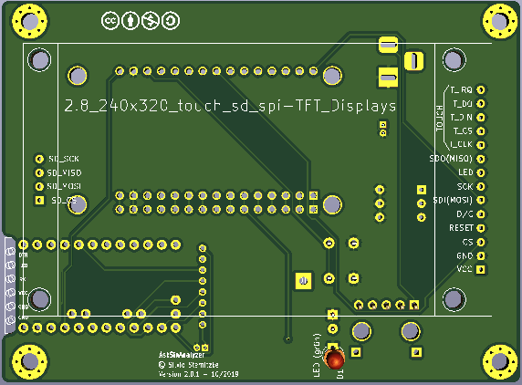
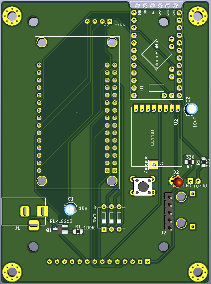
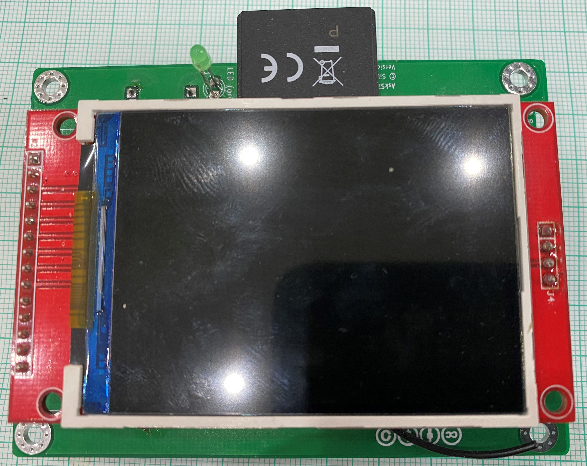
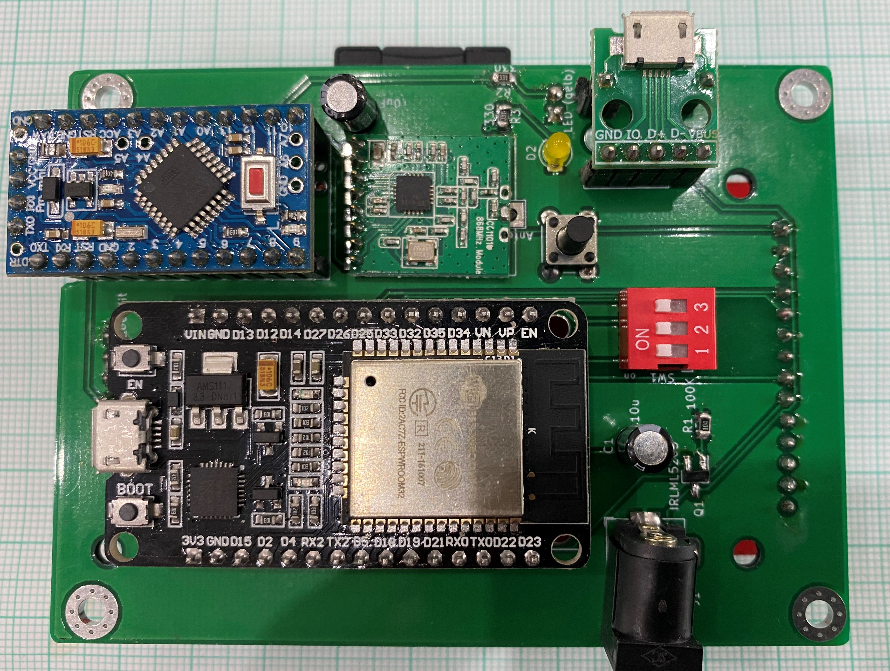

# PCB für den AskSinAnalyzer

## Bilder

## Schaltplan

[:arrow_right: Schaltplan](Images/Schaltplan.pdf)

## Platine

[:arrow_right: PCB Gerber](Platine/AskSinAnalyzer V2.0.3.zip)

## Gehäuse

## Aufbau / Stückliste

### Der Aufbau

Bestückung Frontseite 

Bestückung Rückseite 
Hier gut zu erkennen, der verwendetet ESP32. Das PinOut ist etwas anders. 

AskSinnAnalyzer in Betrieb 

### Die benötigten Bauteile
| Bauteil | Link |
| --------|------|
| | |

## Hinweise

- :exclamation: Der verwendete ESP32 hatte ein, gegenüber der Beschreibung im Projekt, etwas verändertetes Layout. siehe [Beitrag im Forum](https://homematic-forum.de/forum/viewtopic.php?f=76&t=51161&p=527419#p527456]

## Lizenz

**Creative Commons BY-NC-SA** 
Give Credit, NonCommercial, ShareAlike

 This work is licensed under a <a rel="license" href="http://creativecommons.org/licenses/by-nc-sa/4.0/">Creative Commons Attribution-NonCommercial-ShareAlike 4.0 International License</a>.
